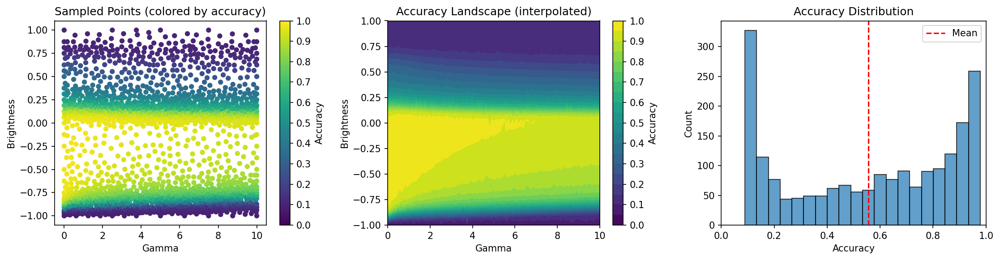
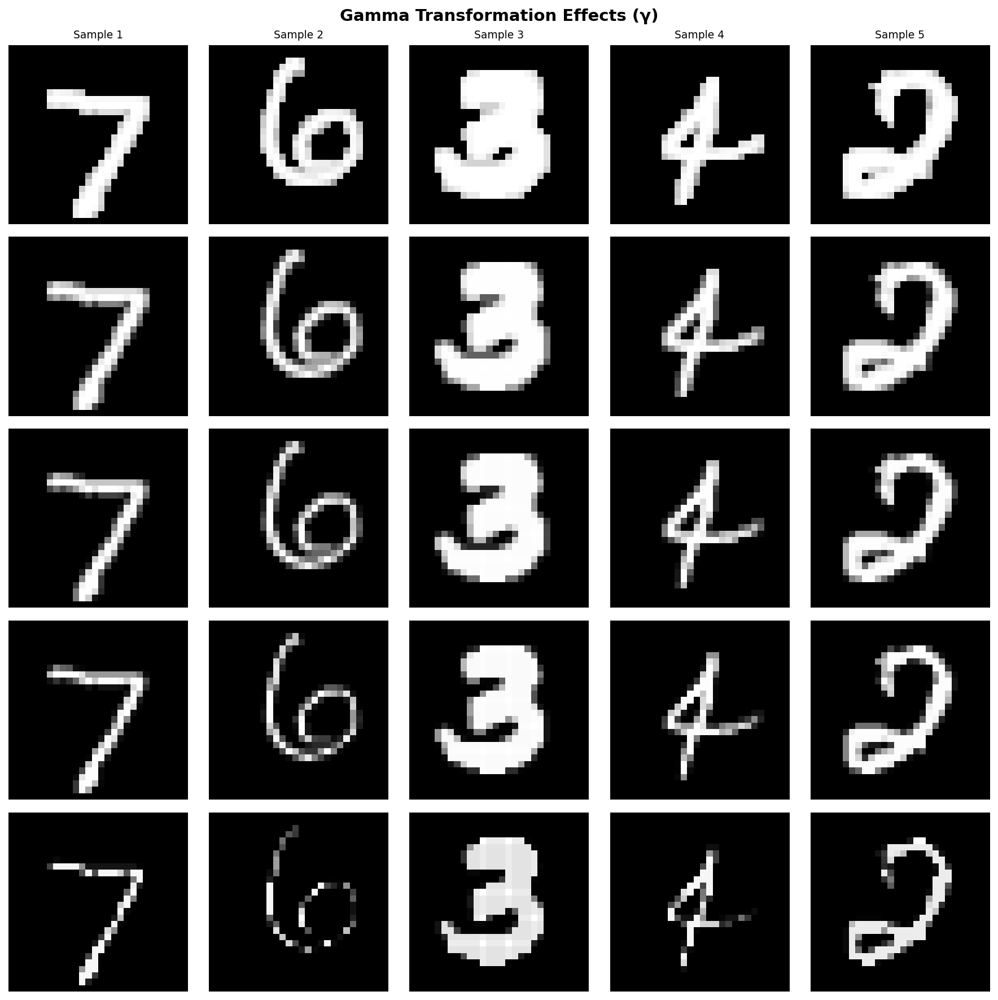
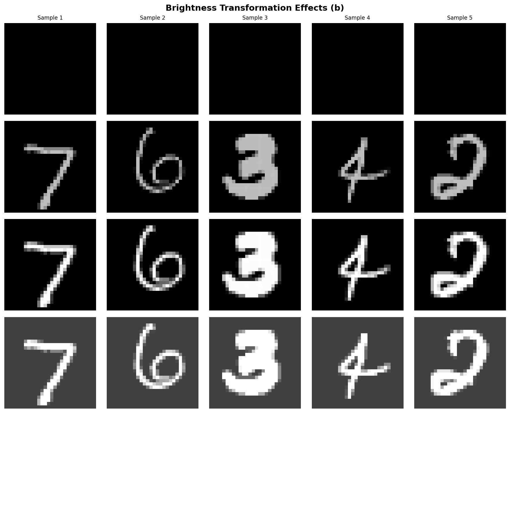
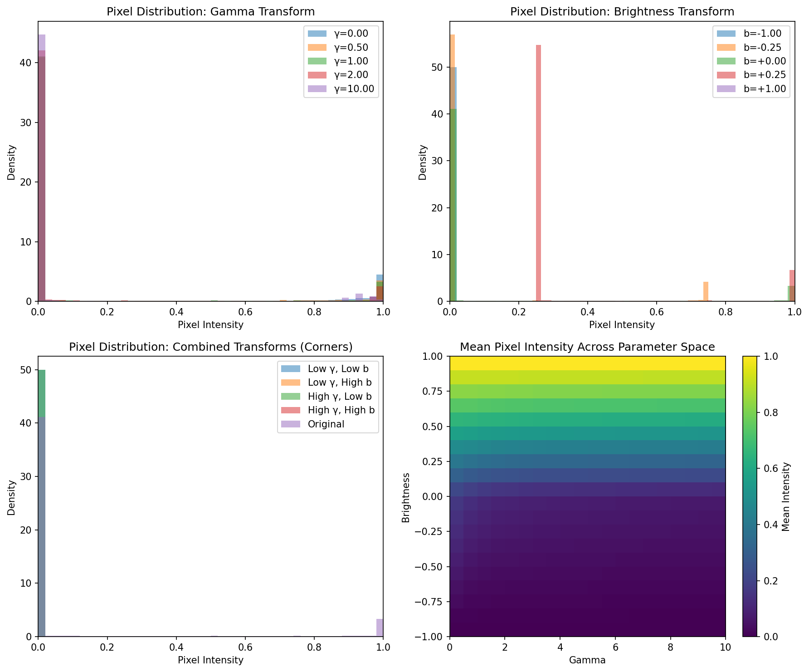

# Robustness Benchmark for MNIST Classifiers

## Abstract
This repository presents a scientific benchmark and sensitivity analysis of image classifiers on the MNIST dataset, focusing on the effects of gamma and brightness transformations. The study extends the [scikit-learn MNIST benchmark](https://github.com/scikit-learn/scikit-learn/blob/main/benchmarks/bench_mnist.py) by introducing adaptive sampling (via [python-adaptive](https://adaptive.readthedocs.io/)) to efficiently probe the classifier's robustness to input perturbations.

## Methods
- **Classifier**: Multilayer Perceptron (MLP-adam) trained on MNIST using scikit-learn's pipeline.
- **Augmentations**: Input images are transformed by:
  - Gamma correction: $I_{out} = I_{in}^{\gamma}$
  - Brightness shift: $I_{out} = \mathrm{clip}(I_{in} + b, 0, 1)$
- **Sensitivity Analysis**: The parameter space $(\gamma, b)$ is adaptively sampled using `python-adaptive` to focus on regions of rapid accuracy change. Extreme ranges were explored: $\gamma \in [0, 10]$, $b \in [-1, 1]$.
- **Reproducibility**: All experiments can be reproduced with:

```bash
uv run mnist_robustness.py --classifiers MLP-adam
uv run sensitivity_analysis.py \
  --npoints 1000 \
  --plot sensitivity_plot.png \
  --plot-transforms transforms.png \
  --gamma-min 0 --gamma-max 10 \
  --n-workers 5 \
  --brightness-min -1 --brightness-max 1
```

## Results

- **Summary statistics** (from `sensitivity_results.npz`):
  - Number of sampled points: **2002**
  - Mean accuracy: **0.556**
  - Std accuracy: **0.315**
  - Min accuracy: **0.0892**
  - Max accuracy: **0.9784**
  - Worst-case: $\gamma=0.0$, $b=-1.0$ $\rightarrow$ accuracy = **0.0892**
  - Best-case: $\gamma\approx0.37$, $b\approx-0.21$ $\rightarrow$ accuracy = **0.9784**

- **Visualization**:
  - 
    - The left panel shows sampled points colored by accuracy (colorbar: 0.0–1.0, step 0.1).
    - The middle panel interpolates accuracy over the $(\gamma, b)$ space, revealing regions of high and low robustness.
    - The right panel shows the distribution of accuracy values.
  - 
    - Example images under varying gamma.
  - 
    - Example images under varying brightness.
  - 
    - Pixel intensity histograms and mean intensity heatmap for the explored parameter space.

## Discussion
- **Gamma and brightness extremes**: The classifier is highly sensitive to strong negative and positive brightness ($b \ll 0$  or $b \gg 0$) and extreme gamma ($\gamma \ll 1$ or $\gg 1$).
These transformations can wash out or extinguish digit strokes, leading to near-random accuracy.
- **Best-case robustness**: Mild gamma brightening ($\gamma \approx 0.4$) and slight darkening ($b \approx -0.1$) enhance digit contrast, yielding the highest accuracy.
- **Adaptive sampling**: By focusing on regions of rapid accuracy change, the analysis efficiently identifies critical boundaries in the transform space.
- **Scientific implications**: The results highlight the importance of input normalization and robustness to photometric distortions in real-world deployment. The adaptive approach can be extended to other augmentations (e.g., contrast, blur, noise) and other datasets.

## References
- [scikit-learn MNIST benchmark](https://github.com/scikit-learn/scikit-learn/blob/main/benchmarks/bench_mnist.py) (BSD License)
- [scikit-learn](https://scikit-learn.org/stable/about.html#citing-scikit-learn) (please cite in publications)
- [python-adaptive](https://adaptive.readthedocs.io/) (please cite in publications)

## License
This repository includes code adapted from scikit-learn's benchmark (`bench_mnist.py`, BSD 3-Clause License).
All additional code is provided under the Apache 2.0 license. See [LICENSE](./LICENSE).